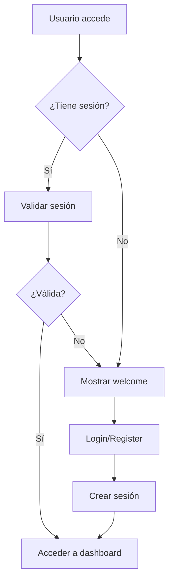

# 5.2.9 Sesiones del Sistema (Session Management)

Incluye la gestión de sesiones de usuario, autenticación, autorización y manejo del estado de la aplicación, utilizando el sistema de sesiones nativo de Laravel con soporte para autenticación de SPA.

## 📁 Estructura de Sesiones

```
├── 📁 Core/Session/
│   ├── 📄 config/session.php - Configuración principal de sesiones
│   ├── 📄 config/auth.php - Configuración de autenticación
│   └── 📄 config/sanctum.php - Configuración de tokens API
│
├── 📁 Middleware/
│   ├── 📄 HandleInertiaRequests.php - Middleware para Inertia.js
│   ├── 📄 AuthenticateSession.php - Autenticación de sesiones (Sanctum)
│   ├── 📄 EncryptCookies.php - Encriptación de cookies (Sanctum)
│   └── 📄 ValidateCsrfToken.php - Validación CSRF (Sanctum)
│
├── 📁 Models/
│   └── 📄 User.php - Modelo de usuario con autenticación
│
├── 📁 Database/
│   ├── 📄 sessions table - Tabla de sesiones en BD
│   ├── 📄 users table - Tabla de usuarios
│   └── 📄 password_reset_tokens table - Tokens de recuperación
│
└── 📁 Views/
    ├── 📄 app.blade.php - Layout principal con token CSRF
    └── 📄 welcome.blade.php - Página de bienvenida con auth
```

---

## 🔧 Configuración de Sesiones

### 📄 `config/session.php`
```php
return [
    // Driver de sesiones: database (almacenado en BD)
    'driver' => env('SESSION_DRIVER', 'database'),
    
    // Tiempo de vida: 120 minutos
    'lifetime' => (int) env('SESSION_LIFETIME', 120),
    
    // Expirar al cerrar navegador
    'expire_on_close' => env('SESSION_EXPIRE_ON_CLOSE', false),
    
    // Encriptación de sesiones
    'encrypt' => env('SESSION_ENCRYPT', false),
    
    // Tabla de sesiones
    'table' => env('SESSION_TABLE', 'sessions'),
    
    // Cookie de sesión
    'cookie' => env('SESSION_COOKIE', 'laravel-session'),
    
    // Configuración de seguridad
    'secure' => env('SESSION_SECURE_COOKIE'),
    'http_only' => env('SESSION_HTTP_ONLY', true),
    'same_site' => env('SESSION_SAME_SITE', 'lax'),
];
```

### 📄 `config/auth.php`
```php
return [
    'defaults' => [
        'guard' => env('AUTH_GUARD', 'web'),
        'passwords' => env('AUTH_PASSWORD_BROKER', 'users'),
    ],
    
    'guards' => [
        'web' => [
            'driver' => 'session',
            'provider' => 'users',
        ],
    ],
    
    'providers' => [
        'users' => [
            'driver' => 'eloquent',
            'model' => App\Models\User::class,
        ],
    ],
];
```

### 📄 `config/sanctum.php`
```php
return [
    // Dominios con estado para SPA
    'stateful' => explode(',', env('SANCTUM_STATEFUL_DOMAINS', 
        'localhost,localhost:3000,127.0.0.1,127.0.0.1:8000,::1'
    )),
    
    // Guards de autenticación
    'guard' => ['web'],
    
    // Middleware de Sanctum
    'middleware' => [
        'authenticate_session' => AuthenticateSession::class,
        'encrypt_cookies' => EncryptCookies::class,
        'validate_csrf_token' => ValidateCsrfToken::class,
    ],
];
```

---

## 🔐 Autenticación y Autorización

### 📄 `app/Models/User.php`
```php
<?php

namespace App\Models;

use Illuminate\Foundation\Auth\User as Authenticatable;
use Laravel\Sanctum\HasApiTokens;
use Spatie\Permission\Traits\HasRoles;

class User extends Authenticatable
{
    use HasApiTokens, HasRoles;
    
    protected $fillable = [
        'name', 'email', 'password', 'activo', 'foto_perfil',
    ];
    
    protected $hidden = ['password', 'remember_token'];
    
    protected $casts = [
        'email_verified_at' => 'datetime',
        'activo' => 'boolean',
    ];
    
    // Relaciones específicas del sistema
    public function produccionesOperador()
    {
        return $this->hasMany(Produccion::class, 'operador_id');
    }
    
    public function produccionesEncargado()
    {
        return $this->hasMany(Produccion::class, 'encargado_id');
    }
}
```

### 🛡️ Middleware de Sesión

#### 📄 `app/Http/Middleware/HandleInertiaRequests.php`
```php
<?php

namespace App\Http\Middleware;

use Inertia\Middleware;

class HandleInertiaRequests extends Middleware
{
    protected $rootView = 'app';
    
    public function share(Request $request): array
    {
        return [
            ...parent::share($request),
            // Compartir datos de sesión con frontend
            'auth' => [
                'user' => $request->user(),
            ],
            'flash' => [
                'success' => fn() => $request->session()->get('success'),
                'error' => fn() => $request->session()->get('error'),
            ],
        ];
    }
}
```

---

## 💾 Base de Datos de Sesiones

### 📄 Tabla `sessions`
```sql
CREATE TABLE sessions (
    id VARCHAR(255) PRIMARY KEY,
    user_id BIGINT UNSIGNED NULL,
    ip_address VARCHAR(45) NULL,
    user_agent TEXT NULL,
    payload LONGTEXT NOT NULL,
    last_activity INT NOT NULL,
    
    INDEX sessions_user_id_index (user_id),
    INDEX sessions_last_activity_index (last_activity)
);
```

### 📄 Tabla `users`
```sql
CREATE TABLE users (
    id BIGINT UNSIGNED AUTO_INCREMENT PRIMARY KEY,
    name VARCHAR(255) NOT NULL,
    email VARCHAR(255) UNIQUE NOT NULL,
    email_verified_at TIMESTAMP NULL,
    password VARCHAR(255) NOT NULL,
    activo BOOLEAN DEFAULT TRUE,
    foto_perfil VARCHAR(255) NULL,
    remember_token VARCHAR(100) NULL,
    created_at TIMESTAMP NULL,
    updated_at TIMESTAMP NULL
);
```

### 📄 Tabla `password_reset_tokens`
```sql
CREATE TABLE password_reset_tokens (
    email VARCHAR(255) PRIMARY KEY,
    token VARCHAR(255) NOT NULL,
    created_at TIMESTAMP NULL
);
```

---

## 🌐 Rutas con Autenticación

### 📄 `routes/web.php`
```php
<?php

use Illuminate\Support\Facades\Route;

// Rutas públicas
Route::get('/', function () {
    return redirect('/welcome');
});

Route::get('/welcome', [WelcomeController::class, 'index'])
    ->name('welcome');

// Rutas protegidas por autenticación
Route::middleware(['auth', 'verified'])->group(function () {
    Route::get('/dashboard', [DashboardController::class, 'index'])
        ->name('dashboard');
    
    Route::resource('maquinas', MaquinaController::class);
    
    Route::prefix('planta')->name('planta.')->group(function () {
        Route::get('/monitor-maquina', [MonitorMaquinaController::class, 'index'])
            ->name('monitor-maquina.index');
        Route::get('/monitor-maquina/{maquina}', [MonitorMaquinaController::class, 'show'])
            ->name('monitor-maquina.show');
    });
});
```

### 📄 `routes/api.php`
```php
<?php

use Illuminate\Support\Facades\Route;

// Ruta protegida por Sanctum
Route::get('/user', function (Request $request) {
    return $request->user();
})->middleware('auth:sanctum');

// Rutas de API para simulación (sin autenticación)
Route::post('/simular-produccion', [SimulacionController::class, 'simularProduccion']);
Route::get('/maquina/{maquina}/estado', [MonitorMaquinaController::class, 'getEstado']);
Route::put('/maquina/{maquina}/estado', [MaquinaEstadoController::class, 'updateEstado']);
```

---

## 🎨 Vistas con Autenticación

### 📄 `resources/views/app.blade.php`
```php
<!DOCTYPE html>
<html lang="{{ str_replace('_', '-', app()->getLocale()) }}">
<head>
    <meta charset="utf-8">
    <meta name="viewport" content="width=device-width, initial-scale=1">
    <meta name="csrf-token" content="{{ csrf_token() }}">
    
    <title>{{ config('app.name', 'Fábrica Biodegradable') }}</title>
    
    @vite(['resources/css/app.css', 'resources/js/app.js'])
    @inertiaHead
</head>
<body class="antialiased">
    @inertia
</body>
</html>
```

### 📄 `resources/views/welcome.blade.php`
```php
@if (Route::has('login'))
    <nav class="flex items-center justify-end gap-4">
        @auth
            <a href="{{ url('/dashboard') }}" class="...">
                Dashboard
            </a>
        @else
            <a href="{{ route('login') }}" class="...">
                Log in
            </a>
            
            @if (Route::has('register'))
                <a href="{{ route('register') }}" class="...">
                    Register
                </a>
            @endif
        @endauth
    </nav>
@endif
```

---

## ⚙️ Variables de Entorno

### 📄 `.env`
```env
# Configuración de sesiones
SESSION_DRIVER=database
SESSION_LIFETIME=120
SESSION_ENCRYPT=false
SESSION_PATH=/
SESSION_DOMAIN=null
SESSION_SECURE_COOKIE=false
SESSION_HTTP_ONLY=true
SESSION_SAME_SITE=lax
SESSION_PARTITIONED_COOKIE=false

# Configuración de autenticación
AUTH_GUARD=web
AUTH_PASSWORD_BROKER=users
AUTH_MODEL=App\Models\User
AUTH_PASSWORD_TIMEOUT=10800

# Configuración de Sanctum
SANCTUM_STATEFUL_DOMAINS=localhost,localhost:3000,127.0.0.1,127.0.0.1:8000,::1

# Configuración de la aplicación
APP_NAME="Fábrica Biodegradable"
APP_ENV=local
APP_KEY=base64:...
APP_URL=http://127.0.0.1:8000
APP_LOCALE=es
```

---

## 🚀 Configuración del Bootstrap

### 📄 `bootstrap/app.php`
```php
<?php

use Illuminate\Foundation\Application;
use Illuminate\Foundation\Configuration\Middleware;

return Application::configure(basePath: dirname(__DIR__))
    ->withRouting(
        web: __DIR__.'/../routes/web.php',
        api: __DIR__.'/../routes/api.php',
        commands: __DIR__.'/../routes/console.php',
        channels: __DIR__.'/../routes/channels.php',
        health: '/up',
    )
    ->withMiddleware(function (Middleware $middleware): void {
        $middleware->web(append: [
            \App\Http\Middleware\HandleInertiaRequests::class,
        ]);
    })
    ->withExceptions(function (Exceptions $exceptions): void {
        //
    })->create();
```

---

## 🔄 Flujo de Sesión

### 1. **Inicio de Sesión**


### 2. **Gestión de Estado**
- **Sesiones**: Almacenadas en base de datos
- **Tokens CSRF**: Para protección contra ataques
- **Cookies**: Encriptadas y seguras
- **API Tokens**: Sanctum para autenticación de API

### 3. **Middleware Stack**
1. **EncryptCookies** - Encripta cookies
2. **ValidateCsrfToken** - Valida tokens CSRF
3. **HandleInertiaRequests** - Maneja requests de Inertia
4. **AuthenticateSession** - Autentica sesiones API

---

## 🛠️ Herramientas y Características

### **Laravel Sanctum**
- Autenticación para SPA
- Tokens API sin estado
- Protección CSRF
- Dominios con estado configurables

### **Spatie Permission**
- Gestión de roles y permisos
- Integración con User model
- Cache de permisos
- Middleware de autorización

### **Inertia.js**
- SPA sin API
- Compartir datos de sesión
- Redirecciones automáticas
- Manejo de formularios

### **Session Storage**
- Driver: Database
- Encriptación opcional
- Limpieza automática
- Configuración flexible

---

## 📊 Monitoreo y Logs

### **Session Tracking**
```php
// En controllers
Log::info('Usuario autenticado', [
    'user_id' => auth()->id(),
    'session_id' => session()->getId(),
    'ip' => request()->ip()
]);
```

### **Limpieza de Sesiones**
```bash
# Comando para limpiar sesiones expiradas
php artisan session:gc
```

---

## 🔒 Seguridad

### **Configuraciones de Seguridad**
- **HTTPS Only**: Para producción
- **HTTP Only**: Prevenir acceso JS malicioso
- **SameSite**: Protección CSRF
- **Secure Cookie**: Solo HTTPS
- **Session Timeout**: 120 minutos por defecto

### **Protecciones Implementadas**
- ✅ **CSRF Protection** - Tokens en formularios
- ✅ **Session Fixation** - Regeneración de ID
- ✅ **Cookie Security** - Flags de seguridad
- ✅ **XSS Prevention** - Escape automático
- ✅ **SQL Injection** - Eloquent ORM

---

*Sistema de sesiones robusto y seguro para la gestión de usuarios en la aplicación de fábrica biodegradable, utilizando las mejores prácticas de Laravel y herramientas modernas de autenticación.*
