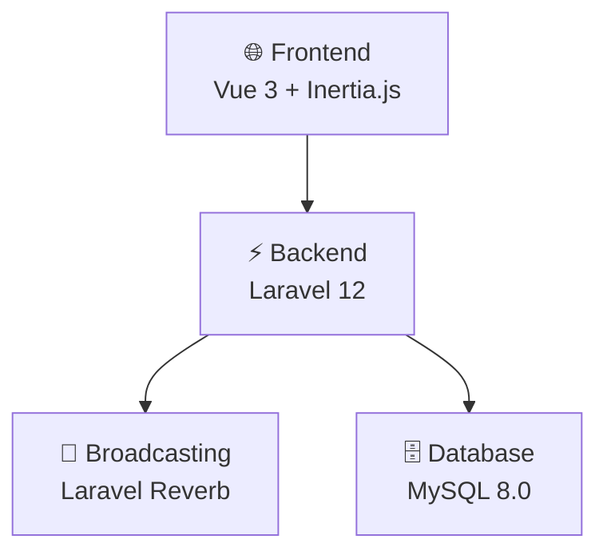
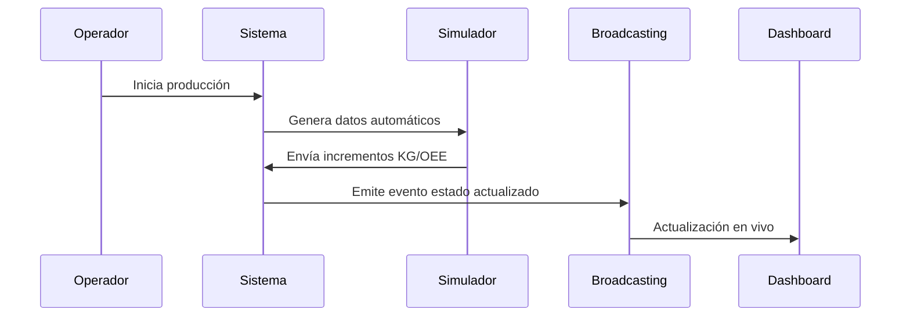

# Sistema de Gestión de Fábrica Biodegradable

## 5.1 Análisis Modular de la Solución

### 🏗️ Arquitectura del Sistema

La aplicación está diseñada con una **arquitectura moderna y escalable** que conecta diferentes capas tecnológicas de manera eficiente:

#### 🛠️ Stack Tecnológico



**Frontend:**
- **Vue 3** con Composition API para interfaces reactivas
- **Inertia.js v2** para SPA sin API separada
- **TailwindCSS v4** para diseño responsivo y moderno

**Backend:**
- **Laravel 12** como framework principal
- **PHP 8.4** con tipado estricto y rendimiento optimizado
- **Laravel Sanctum** para autenticación API
- **Spatie Permissions** para control de roles y permisos

**Tiempo Real:**
- **Laravel Reverb** para WebSockets nativos
- **Broadcasting Events** para actualizaciones en vivo

**Base de Datos:**
- **MySQL 8.0** con relaciones optimizadas
- **Migraciones versionadas** para control de esquema
- **Seeders** para datos de prueba y producción

---

### 📦 Módulos Principales del Sistema

#### 1. **Módulo de Máquinas** 🏭
**Ubicación:** `app/Models/Maquina.php`, `app/Http/Controllers/MaquinaController.php`

**Responsabilidades:**
- Gestión del inventario de maquinaria industrial
- Control de estados operativos (Operativa, Mantenimiento, Fuera de servicio)
- Clasificación por tipos (Inyección, Extrusión, Soplado, etc.)
- Seguimiento de horas de trabajo y ubicación en planta

**Entidades Relacionadas:**
- `TipoMaquina` - Clasificación de equipos
- `MaquinaEstadoVivo` - Estado en tiempo real
- `Produccion` - Registro de actividad productiva

#### 2. **Módulo de Producción** 📊
**Ubicación:** `app/Services/ProduccionService.php`, `app/Models/Produccion.php`

**Responsabilidades:**
- Registro de producción por turnos
- Cálculo de KPIs (OEE, velocidad, rendimiento)
- Gestión de lotes de productos terminados
- Consumo de materias primas por producción

**Funcionalidades Clave:**
- Simulación de producción para pruebas
- Tracking de incrementos de kilogramos producidos
- Análisis de eficiencia operacional

#### 3. **Módulo de Materias Primas** 🧪
**Ubicación:** `app/Models/MateriaPrima.php`, `app/Models/LoteMateriaPrima.php`

**Responsabilidades:**
- Inventario de materiales biodegradables
- Trazabilidad por lotes con fechas de vencimiento
- Control de stock y alertas de reposición
- Gestión de proveedores especializados

#### 4. **Módulo de Monitoreo en Tiempo Real** 📡
**Ubicación:** `app/Http/Controllers/Planta/MonitorMaquinaController.php`

**Responsabilidades:**
- Dashboard en vivo del estado de máquinas
- Eventos de broadcasting automático
- Alertas y notificaciones instantáneas
- Métricas operacionales en tiempo real

---

### 🔄 Flujo de Datos y Procesos

#### **Proceso de Producción**


#### **Gestión de Estados de Máquina**
1. **Registro Inicial:** Nueva máquina → `MaquinaEstadoVivo`
2. **Simulación:** Datos generados → `ProduccionService`
3. **Broadcasting:** Evento → Todos los dashboards conectados
4. **Persistencia:** Base de datos → Histórico completo

---

### 📊 Datos Generados Automáticamente

El sistema incluye un **simulador inteligente** que genera datos realistas:

| 📏 **Métrica** | 🎯 **Rango Simulado** | 💡 **¿Por qué este rango?** |
|---|---|---|
| **Kg Producidos** | 0,1 - 2,5 kg | Incrementos realistas por ciclo |
| **Velocidad** | 80% - 120% | Variación normal de máquinas |
| **OEE** | 70% - 95% | Rango típico industrial |
| **Tiempo Ciclo** | 10 - 30 seg | Velocidad de máquinas reales |

#### 🎯 **¿Para qué sirve?**
- ✅ **Desarrollo seguro** - Prueba cambios sin afectar producción real
- 📈 **Demostración** - Muestra el sistema funcionando a clientes
- 🎓 **Entrenamiento** - Capacita usuarios sin riesgo
- 🔍 **Depuración** - Encuentra problemas antes del despliegue

> 💡 **Consejo:** Deja el simulador corriendo mientras desarrollas, ¡verás el sistema cobrar vida! ✨

---

### 🏛️ Arquitectura por Capas

#### **Capa de Presentación** (Frontend)
```
resources/js/
├── Components/     # Componentes reutilizables Vue
├── Pages/          # Páginas de aplicación
└── Layouts/        # Plantillas base
```

#### **Capa de Lógica de Negocio** (Backend)
```
app/
├── Http/Controllers/   # Controladores de rutas
├── Services/          # Lógica de negocio
├── Models/           # Eloquent ORM
└── Events/           # Eventos del sistema
```

#### **Capa de Datos**
```
database/
├── migrations/    # Esquema de base de datos
├── seeders/      # Datos de prueba
└── factories/    # Generadores de datos
```

---

### 🔐 Seguridad y Permisos

#### **Sistema de Roles**
- **Administrador:** Control total del sistema
- **Gerente:** Supervisión y reportes
- **Encargado de Planta:** Operaciones diarias
- **Operador:** Uso específico de máquinas

#### **Autenticación**
- Laravel Sanctum para APIs seguras
- Middleware de autenticación en todas las rutas críticas
- Tokens de sesión para frontend

---

### 📈 Escalabilidad y Rendimiento

#### **Optimizaciones Implementadas**
- **Eager Loading:** Previene consultas N+1
- **Broadcasting Eficiente:** Solo datos necesarios
- **Índices de Base de Datos:** Consultas optimizadas
- **Caché de Configuración:** Arranque rápido

#### **Preparado para Crecer**
- Arquitectura por servicios expandible
- Base de datos relacional normalizada
- APIs RESTful estándar
- Contenedorización con Docker (opcional)

---

### 🛠️ Comandos de Desarrollo

```bash
# Configuración inicial
composer install
npm install
cp .env.example .env
php artisan key:generate
php artisan migrate --seed

# Desarrollo
npm run dev              # Frontend en desarrollo
php artisan serve       # Servidor Laravel
php artisan reverb:start # WebSockets

# Producción
npm run build           # Compilar frontend
php artisan config:cache # Optimizar configuración
```

---

### 🎯 Beneficios del Diseño Modular

✅ **Mantenibilidad:** Cada módulo tiene responsabilidades claras
✅ **Escalabilidad:** Fácil agregar nuevas funcionalidades  
✅ **Testabilidad:** Componentes independientes y probables
✅ **Reutilización:** Servicios compartidos entre módulos
✅ **Flexibilidad:** Arquitectura adaptable a cambios de negocio

---

*Este sistema representa una solución integral para la gestión de fábricas biodegradables, combinando tecnologías modernas con prácticas de desarrollo sostenible.*
