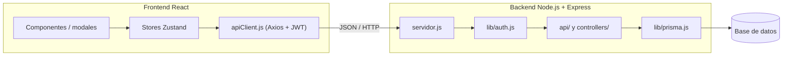

<div align="center">
  
  <h1>DOCUMENTACION</h1>
  <p><b>Documentación técnica en español sobre cómo un frontend React consume una API REST (AJAX/JSON) en Node.js + Express + Prisma, tomando ElectroShopWeb como caso.</b></p>
  
  
  
  
  <p>
    <a href="#-índice-de-documentos">Índice</a> ·
    <a href="#-características">Contenido</a> ·
    <a href="#-arquitectura">Arquitectura</a> ·
    <a href="#-cómo-leerlo">Cómo leerlo</a> ·
    <a href="#-lo-que-todavía-no-existe">Limitaciones</a>
  </p>
</div>

Este repositorio **solo contiene documentación** (un documento Markdown). No tiene código ejecutable, dependencias ni
instalación. Describe, archivo por archivo, la arquitectura asíncrona (AJAX con JSON) del proyecto **ElectroShopWeb**:
React + Zustand + Axios en el cliente y Express + Prisma en el servidor. El código que describe **vive en otro
repositorio y no está aquí**, así que no se pudo contrastar con él desde este repo.

## 🎬 Vista rápida

Sin capturas (es texto). La idea central del documento, el recorrido de "Añadir al carrito":

```text
Clic en "Añadir" ─> useCartStore.js ─> apiClient.js (POST /carrito + JWT) ─> servidor.js (express.json)
   ─> auth.js (valida token) ─> CarritoController.js ─> prisma.js (BD) ─> res.json({ success: true }) ─> toast en React
```

## 📚 Índice de documentos

| Documento | Qué cubre |
|---|---|
| [`docs/arquitectura-ajax-electroshopweb.md`](docs/arquitectura-ajax-electroshopweb.md) | Enciclopedia de la arquitectura AJAX de ElectroShopWeb (7 secciones, ver abajo). Es el contenido íntegro del README anterior de este repo |

## ✨ Características

Secciones del documento principal:

| # | Sección | Detalle |
|---|---|---|
| 1 | Frontend: motores y estados globales | `src/services/` (`apiClient.js`, `api.js`) y `src/store/` (`useAuthStore`, `useCartStore`, `useCatalogStore`) |
| 2 | Frontend: componentes, hooks y `fetch` nativo | `useEffect` como disparador; modales de pago con `fetch` en vez de Axios |
| 3 | Backend base (Express) | `server/servidor.js`, `server/lib/auth.js`, `server/lib/prisma.js` |
| 4 | Backend V1: enrutadores API | `server/api/` (`carrito`, `compras`, `categorias`, `productos`, `login`/`registro`, `estado`) |
| 5 | Backend V2: controladores MVC | `server/src/controllers/` (`Auth`, `Carrito`, `Compra`, `Catalogo`) |
| 6 | Verbos HTTP | GET / POST / PUT-PATCH / DELETE y su uso |
| 7 | Flujo completo "Añadir al carrito" | Los 7 pasos de extremo a extremo |

## 🏗️ Arquitectura

Lo que documenta el texto (no es código de este repo):


```mermaid
flowchart LR
    subgraph Cliente["Frontend React"]
        C["Componentes / modales"] --> S["Stores Zustand"]
        S --> A["apiClient.js (Axios + JWT)"]
    end
    subgraph Servidor["Backend Node.js + Express"]
        A -->|"JSON / HTTP"| E["servidor.js"]
        E --> AU["lib/auth.js"]
        AU --> R["api/ y controllers/"]
        R --> P["lib/prisma.js"]
    end
    P --> DB[("Base de datos")]
```

## 🚀 Cómo leerlo

No hay que instalar nada.

1. Abre [`docs/arquitectura-ajax-electroshopweb.md`](docs/arquitectura-ajax-electroshopweb.md) en GitHub o en tu editor.
2. Empieza por la sección 7 si quieres el resumen del flujo, y vuelve a las secciones 1-5 para el detalle por archivo.

<details>
<summary>Estructura del repositorio</summary>

```text
README.md                                   # este índice
docs/
  arquitectura-ajax-electroshopweb.md       # documento original, sin cambios de contenido
  assets/logo.svg
```

</details>

## 🧪 Pruebas

No aplica: no hay código. Lo único comprobado es que el documento original se conservó idéntico (salvo saltos de línea) al mover su contenido a `docs/`.

## 🚧 Lo que todavía no existe

- Un solo documento; no hay guías para otros proyectos ni índice por temas.
- El documento describe ElectroShopWeb, cuyo código **no está en este repositorio**: sus afirmaciones (nombres de archivos, endpoints, códigos de estado) no se verificaron aquí.
- El documento original es narrativo y con tono muy informal; no incluye diagramas ni enlaces al código fuente.
- Los fragmentos de código son extractos ilustrativos, no un ejemplo ejecutable.

## 📄 Licencia

Sin licencia definida: todos los derechos reservados por defecto.

<div align="center"><sub>Hecho por Luiss2080 · Documentación técnica en español</sub></div>
